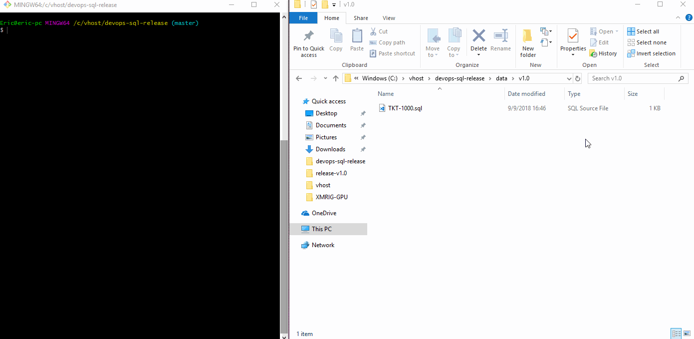

# devops-sql-release
Perl based DEVOPS tool for automating release SQL script building from individual team tickets

The intent of this tool is to help automate building a SQL release candidate file for teams that have a development 
database and a production database.

Typically, such teams will have features built over the course of several sprints and multiple database changes will occur throughout
the release cycle leading up to a new release candidate.  On release day/night, it is imperative that all work done on the development
database server be reflected on the production server.  For those teams who choose to handle this by way of a release file built up over
time from the constituent SQL scripts written by the team during the sprint(s) leading up to a release, this tool may come in handy.

Licensed under GNU GPL v3.0
